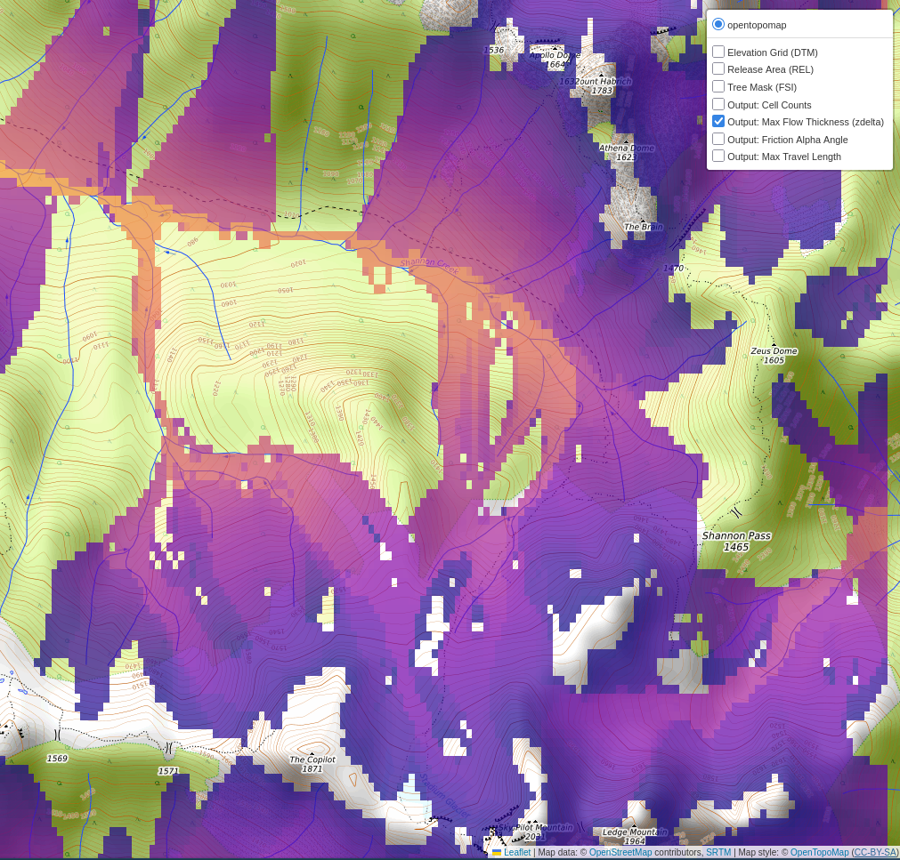

# avalayers

`avalayers` is a user interface for preparing, simulating, and visualizing avalanche flow dynamics using the [**FlowPy** (AvaFrame) engine](https://docs.avaframe.org/en/latest/moduleCom4FlowPy.html). 



## Key Features

- **Automated Data Processing**: Download and merge 30m resolution DTM/DSM tiles across custom bounding boxes.
- **Dynamic Terrain Analysis**: Calculate Canopy Height Models (CHM) and normalize them into Forest Structure Information (FSI) layers.
- **Interactive Start-Zone Tuning**: Refine avalanche release zones in real-time via a command-line interface and topographical map previews.
- **Integrated Dashboard**: Generate interactive, browser-based dashboards with toggleable layers.
- **3D Export**: One-click generation of KMZ files for visualization in Google Earth Pro.

## Installation

This project uses `uv` for dependency management.

```bash
# Clone the repository
git clone <repo-url>
cd avylayers

# Create environment and install dependencies
uv sync
```

## Quick Start

### 1. Acquire Elevation Data
Download tiles for your region of interest (e.g., Sky Pilot, BC).
```bash
uv run -m avalayers download --bbox -123.1488 49.6315 -123.0692 49.6684
```

### 2. Prepare Simulation Project
Generate the DTM, FSI, and Release Area masks.
```bash
uv run -m avalayers prepare \
    --dtm data/dems/fabdem_dtm_-123.1488_49.6315_-123.0692_49.6684.tif \
    --dsm data/dems/copernicus_glo30_dsm_-123.1488_49.6315_-123.0692_49.6684.tif \
    --out MySimulation
```

## Scientific Documentation
For detailed more information on options and usage, please refer to the [User Guide](user_guide.md).

## License
GPL-3.0
